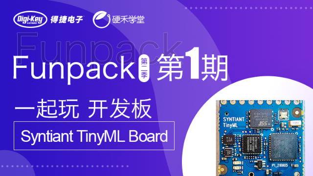

# Syntiant_TinyML_Board_Demo

[Funpack 第二季第一期：Syntiant TinyML Board](https://www.eetree.cn/project/detail/870)

- [x] 任务一：用自带的麦克风，搭建机器学习模型，使板卡上的 LED 灯根据中文语音指令（不少于三个指令）呈现出不同效果，如开灯、关灯、闪烁、SOS、呼吸等。
- [ ] 任务二：若您针对这个板卡有更好的创意，可自命题完成（难度不能低于任务一）。

新建工程选择对应的开发板 Syntiant 开发板，按照参考语音识别教程的采集数据，设置参数和生成模型。

两种方式

- 一口气说完关键词。例如四字关键词，打开红灯、打开绿灯、打开蓝灯、关灯
- 关键词分开说。例如先说“你好”，再说“开灯”

| 标签          | 关键词   | 动作 |
| ------------- | -------- | ---- |
| turn_on_blue  | 打开蓝灯 |      |
| turn_on_green | 打开绿灯 |      |
| turn_on_red   | 打开红灯 |      |
| turn_off      | 关灯     |      |

相关链接

- [Syntiant TinyML Board 简介](https://getiot.tech/syntiant/syntiant-tinyml-board-intro.html)
- [Syntiant TinyML Board 固件下载](https://getiot.tech/syntiant/syntiant-tinyml-board-firmwares.html)
- [Syntiant TinyML Board 识别声音](https://getiot.tech/syntiant/syntiant-tinyml-board-responding-to-your-voice.html)

